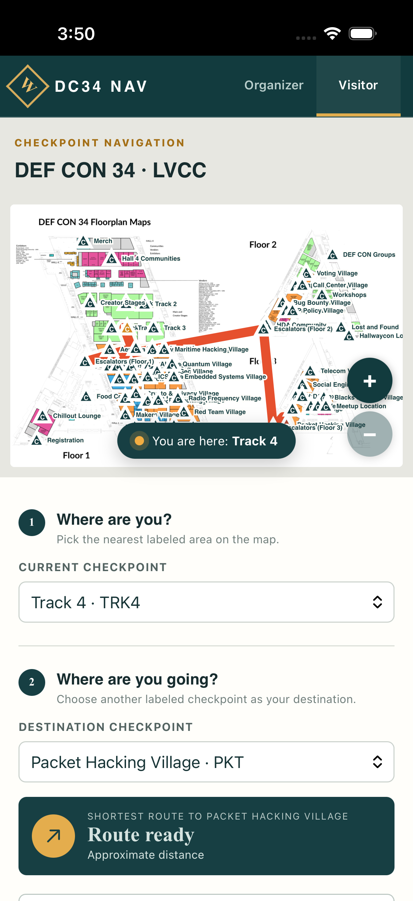
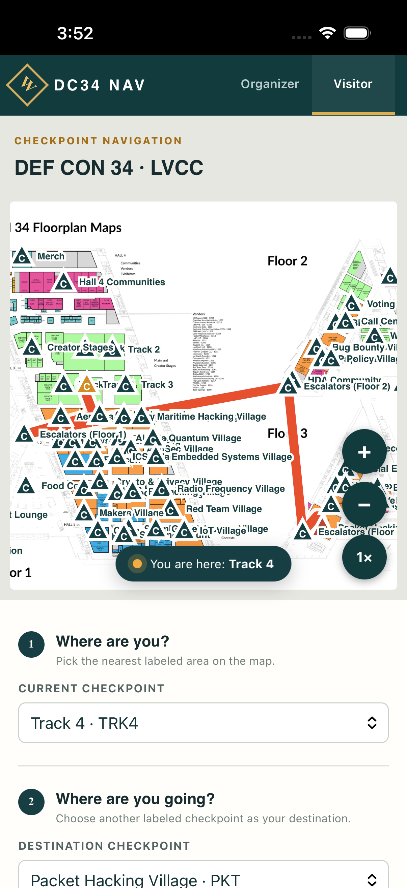

# DC34 NAV — DEF CON 34 offline navigator

Offline indoor navigation for **DEF CON 34** at the Las Vegas Convention Center (Aug 6–9, 2026). Open the app, pick where you are and where you're going, get the shortest walking route — across all 3 floors, with zero network, zero accounts, zero tracking.

Built on [**Waypoint**](https://github.com/Pizzawookiee/Waypoint) (see Credits).

  
  

## How to use

1. Open the app — the DEF CON 34 map loads automatically with all 61 checkpoints (villages, tracks, stages, registration, food, escalators).
2. **Where are you?** Pick the nearest labeled area from the *Current checkpoint* dropdown (e.g. `Registration · REG`). A "You are here" marker appears.
3. **Where are you going?** Pick any destination checkpoint (e.g. `Packet Hacking Village · PKT`). The shortest route draws on the map — cross-floor routes go via the Escalators checkpoints (follow the line to the escalator, ride to the target floor, continue).
4. Use the **+ / − / 1×** buttons on the map to zoom and drag to pan.
5. As you walk, update your current checkpoint whenever you pass a labeled area — the route recalculates.

Everything is stored on-device; the map keeps working in the deepest Wi-Fi dead zone in Hall 3.

## Running it

- **Web/dev**: `npm install && npm run dev` → http://127.0.0.1:5173
- **iOS**: `npm run build && npx cap sync ios`, open `ios/App/App.xcodeproj`, set your signing team, run to device.
- **Android**: `npm run build && npx cap sync android && cd android && ./gradlew assembleDebug` → sideload `app/build/outputs/apk/debug/app-debug.apk`.
- Tests / checks: `npm test`, `npm run typecheck`.

DEF CON data lives in `src/defcon/` (checkpoint graph, pack builder). The map asset is `public/defcon34-map.jpg`, rendered from the official DC34 floorplan PDF. The docs-first build process (research → plan → review → fleet) is preserved under `docs/`.

## Credits

- **[Waypoint](https://github.com/Pizzawookiee/Waypoint)** by [Pizzawookiee](https://github.com/Pizzawookiee) — the entire navigation engine: floor-plan checkpoint model, Dijkstra routing, offline PWA architecture, organizer/visitor UI, and optical navpack transfer. This project is a DEF CON 34-specific fork; the generic engine is theirs. Licensed [Apache-2.0](LICENSE).
- **Decimen** (`src/decimen/`) — fountain-coded optical transfer, MIT licensed, vendored from upstream (see `src/decimen/UPSTREAM.md`).
- **DEF CON 34 floorplan** — [DEF CON](https://defcon.org) official maps; this is an unofficial community tool, not affiliated with DEF CON.
